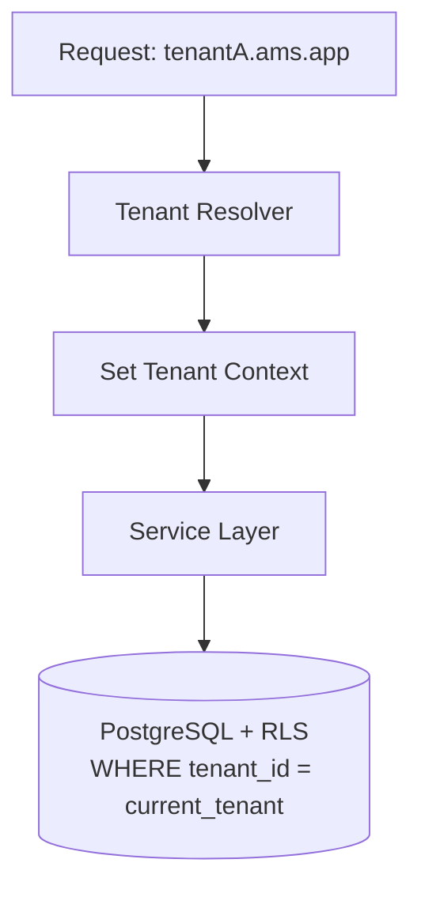

# 00 — Analisa PRD: Asset Management System (Enterprise & SaaS Multi-Tenant)

| | |
|---|---|
| **Produk** | Asset Management System (AMS) |
| **Target** | Enterprise + SaaS Multi-Tenant |
| **Sumber** | PRD Aplikasi Aset Management v1.0 (Juli 2026) |
| **Versi Analisa** | 1.0 |
| **Status** | Baseline untuk 9 dokumen turunan |

---

## 1. Tujuan Dokumen

Dokumen ini merangkum hasil analisa PRD dan menetapkan **keputusan fondasi** yang menjadi acuan konsisten untuk 9 dokumen turunan (SDD, Architecture, ERD, API Spec, UI/UX, User Flow, Testing Plan, Security Design, User Manual).

---

## 2. Ringkasan PRD

Aplikasi mengelola **seluruh siklus hidup aset**: pengadaan, tracking, maintenance, depresiasi, audit, hingga disposal, plus dashboard & reporting.

### 2.1 Cakupan (7 Modul)
1. **Procurement & Onboarding** — input aset, upload dokumen, generate barcode/QR, label aset.
2. **Tracking & Assignment** — assignment, transfer/mutasi (dengan approval), peminjaman, digital handover, asset history.
3. **Maintenance & Inspection** — preventive (terjadwal), corrective (ticket), work order, maintenance history.
4. **Depreciation & Audit** — perhitungan penyusutan otomatis (Straight Line), audit fisik via mobile (scan QR).
5. **Disposal & Retirement** — workflow request → approval → disposal → archive.
6. **Dashboard** — KPI: asset summary, asset value, maintenance, audit.
7. **Reporting** — inventory, location, assignment, maintenance, depreciation, disposal.

### 2.2 User Roles (7)
Super Admin, Asset Administrator, Procurement, Teknisi, Auditor, Department Manager, Employee.

### 2.3 Non-Functional Requirements
- **Performance:** response < 3 detik, 500 concurrent users, 100.000 aset.
- **Security:** RBAC, MFA (opsional), Audit Log, HTTPS, Data Encryption, Backup Harian.
- **Compatibility:** Chrome, Edge, Firefox, Safari.
- **Mobile:** Android, iOS, Responsive Web.

### 2.4 Integrasi
AD/LDAP/Microsoft Entra ID (SSO), ERP (SAP/Oracle/Odoo/Dynamics), Sistem Akuntansi, Email (SMTP/M365), WhatsApp Gateway (opsional), Barcode/QR Scanner, REST API.

### 2.5 KPI Target
Akurasi inventaris ≥ 98%, pencarian aset < 30 detik, maintenance tepat waktu ≥ 95%, keberhasilan audit ≥ 98%, pengurangan kehilangan ≥ 50%, waktu laporan < 5 menit, kepuasan pengguna ≥ 4,5/5.

---

## 3. Analisa Gap & Penambahan (untuk Enterprise + SaaS Multi-Tenant)

PRD ditulis untuk konteks *single-company*. Karena target diperluas menjadi **Enterprise + SaaS Multi-Tenant**, berikut gap yang diidentifikasi dan dilengkapi:

| # | Gap di PRD | Penambahan pada Desain |
|---|-----------|------------------------|
| G1 | Tidak ada konsep tenant | Model **multi-tenancy** (tenant isolation, tenant context, onboarding) |
| G2 | Tidak ada billing/subscription | Modul **Subscription & Billing** (plan, quota, metering) SaaS |
| G3 | Depresiasi hanya Straight Line | Desain *extensible* (Strategy pattern) untuk Declining Balance & Units of Production |
| G4 | SSO disebut sekilas | Desain **Identity & Access** penuh: OIDC/SAML, SCIM provisioning, per-tenant IdP |
| G5 | Tidak ada observability | **Logging, metrics, tracing** (OpenTelemetry), audit trail immutable |
| G6 | Backup harian saja | **DR strategy**: RPO/RTO, PITR, multi-region option |
| G7 | Encryption disebut umum | **Encryption at rest & in transit**, per-tenant key (envelope encryption) |
| G8 | Skalabilitas tidak dirinci | Strategi **horizontal scaling**, caching, async jobs, read-replica |
| G9 | Tidak ada API versioning | **API versioning**, rate limiting per-tenant, idempotency |
| G10 | Approval single-level | **Multi-level approval** engine (future-ready, sudah di roadmap PRD) |

---

## 4. Keputusan Fondasi (Baseline Architecture Decisions)

> Keputusan ini **konsisten** dipakai di semua dokumen turunan.

### 4.1 Strategi Multi-Tenancy
**Default: Shared Database, Shared Schema + `tenant_id` + PostgreSQL Row-Level Security (RLS).**
- Cocok untuk skala SaaS (ribuan tenant kecil-menengah), biaya efisien.
- **Opsi Enterprise:** *Schema-per-tenant* atau *Database-per-tenant* untuk klien besar dengan kebutuhan isolasi/compliance ketat.
- Tenant di-resolve via **subdomain** (`tenantA.ams.app`) atau header `X-Tenant-ID`, dipropagasi melalui *tenant context* di setiap request.

### 4.2 Technology Stack

| Layer | Teknologi | Alasan |
|-------|-----------|--------|
| **Web Frontend** | React 18 + TypeScript + Next.js 14 + TailwindCSS + shadcn/ui + TanStack Query + Zustand | SSR/SEO, DX, komponen enterprise |
| **Mobile** | Flutter 3.x | Cross-platform Android/iOS, kamera/QR scan, offline audit |
| **Backend** | NestJS (Node.js + TypeScript) — modular monolith, microservices-ready | Modular, TS end-to-end, ekosistem enterprise. *(Alternatif: Spring Boot / .NET 8)* |
| **Database** | PostgreSQL 15 (+ RLS) | Relasional kuat, RLS untuk multi-tenant, PITR |
| **Cache/Session** | Redis 7 | Cache, rate limit, session, queue ringan |
| **Search/Analytics** | Elasticsearch / OpenSearch | Pencarian aset < 30 detik, reporting cepat |
| **Object Storage** | S3 / MinIO | Dokumen, foto aset, label |
| **Message Broker** | RabbitMQ (atau Kafka) | Async: notifikasi, depresiasi batch, audit log |
| **Identity** | Keycloak | OIDC/SAML, SSO, federasi AD/Entra, per-tenant realm/IdP |
| **API** | REST (OpenAPI 3.1) + GraphQL (opsional untuk reporting) | Standar, kontrak jelas |
| **Infra** | Docker + Kubernetes (Helm) | Skalabilitas, HA, portabilitas cloud |
| **Observability** | OpenTelemetry + Prometheus + Grafana + Loki | Metrics, tracing, logs |
| **CI/CD** | GitHub Actions / GitLab CI + ArgoCD | Otomasi build, test, deploy |

### 4.3 Prinsip Arsitektur
- **Domain-Driven Design (DDD)** — modul selaras dengan 7 modul bisnis (bounded context).
- **Modular Monolith → Microservices** — mulai monolith modular, pecah ke microservice saat dibutuhkan (mis. Reporting, Notification).
- **API-First** — kontrak OpenAPI sebelum implementasi.
- **Event-Driven** untuk proses async & audit trail.
- **Security & Tenant-Isolation by Design.**
- **12-Factor App** untuk portabilitas cloud.

---

## 5. Pemetaan Modul → Bounded Context → Layanan

| Modul PRD | Bounded Context | Entitas Inti |
|-----------|-----------------|--------------|
| Procurement & Onboarding | `asset-catalog` | Asset, AssetCategory, Vendor, Document |
| Tracking & Assignment | `asset-tracking` | Assignment, Transfer, Borrowing, Handover, AssetHistory |
| Maintenance & Inspection | `maintenance` | MaintenanceSchedule, Ticket, WorkOrder, Sparepart |
| Depreciation & Audit | `finance-audit` | DepreciationEntry, AuditSession, AuditItem |
| Disposal & Retirement | `disposal` | DisposalRequest, DisposalApproval |
| Dashboard & Reporting | `analytics` | KPI views, Report definitions |
| Master Data & Admin | `platform` | Tenant, User, Role, Location, Department |
| (Tambahan SaaS) | `billing` | Subscription, Plan, Invoice, UsageMetric |
| (Tambahan) | `identity` | IdP config, SSO, MFA |
| (Tambahan) | `notification` | Notification, Template, Channel |

---

## 6. Daftar 9 Dokumen Turunan

| # | Dokumen | File | Fokus |
|---|---------|------|-------|
| 1 | Software Design Document (SDD) | `01-Software-Design-Document.md` | Desain detail modul, komponen, class, sequence |
| 2 | Software Architecture Document | `02-Software-Architecture-Document.md` | C4, deployment, multi-tenant, scalability |
| 3 | Database Design (ERD) | `03-Database-Design-ERD.md` | Skema, relasi, RLS, indexing |
| 4 | API Specification | `04-API-Specification.md` | Endpoint REST, OpenAPI, auth, error |
| 5 | UI/UX Design System | `05-UIUX-Design-System.md` | Token, komponen, pattern, accessibility |
| 6 | User Flow | `06-User-Flow.md` | Alur end-to-end per role/modul |
| 7 | Testing Plan | `07-Testing-Plan.md` | Strategi, level, matriks, CI |
| 8 | Security Design | `08-Security-Design.md` | AuthN/Z, tenant isolation, crypto, compliance |
| 9 | User Manual | `09-User-Manual.md` | Panduan pengguna per role |

---

## 7. Asumsi & Batasan

- **Bahasa aplikasi:** ID/EN (i18n-ready).
- **Mata uang:** multi-currency (default IDR).
- **Timezone:** per-tenant (default Asia/Jakarta).
- **Depresiasi awal:** Straight Line (extensible).
- **Deployment:** cloud-native (AWS/Azure/GCP) atau on-prem (opsi enterprise).
- Nilai finansial mengikuti kebijakan akuntansi tenant; sinkronisasi ke ERP bersifat *eventually consistent*.

---

## 8. Traceability

Setiap requirement PRD ditandai kode (`FR-Mx-y` untuk functional, `NFR-x` untuk non-functional) dan direferensikan silang di dokumen turunan agar dapat ditelusuri (traceability matrix ada di Testing Plan §Traceability).
