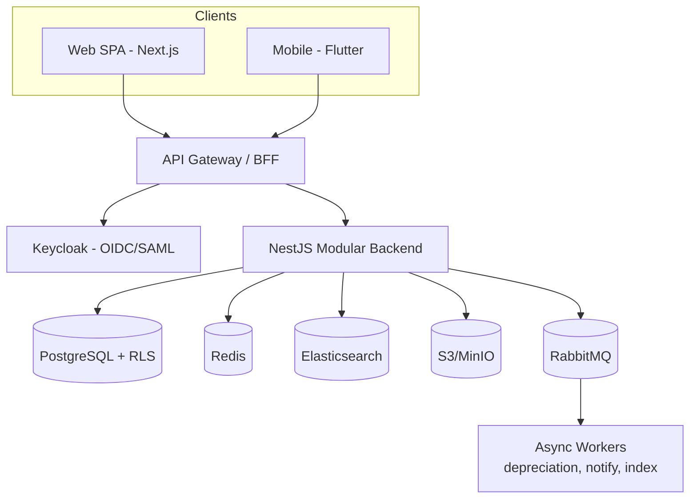
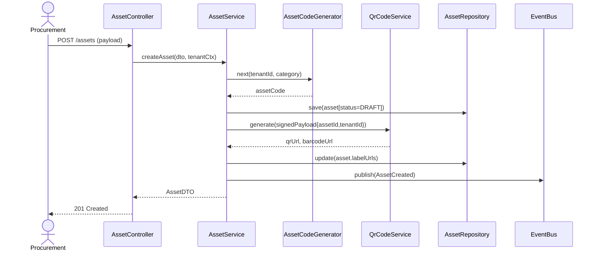
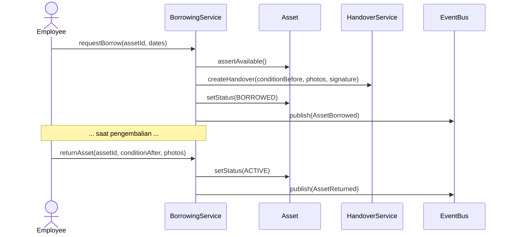
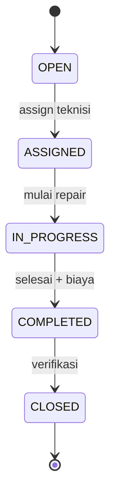
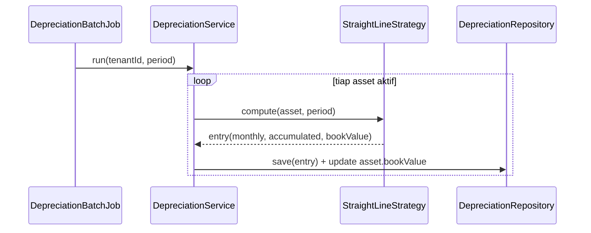
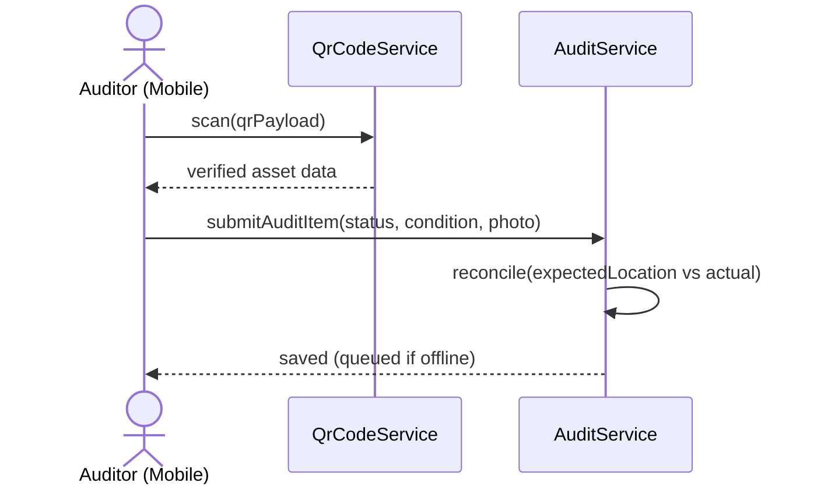
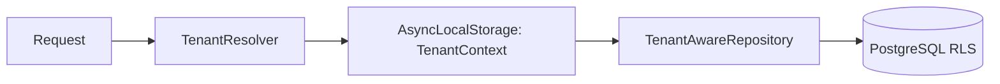

# 01 — Software Design Document (SDD)

**Asset Management System (AMS) — Enterprise & SaaS Multi-Tenant**

| | |
|---|---|
| Versi | 1.0 |
| Tanggal | Juli 2026 |
| Acuan | `00-PRD-Analysis.md`, PRD v1.0 |
| Standar | IEEE 1016 (Software Design Description) |

---

## 1. Pendahuluan

### 1.1 Tujuan
Dokumen ini menjelaskan **desain perangkat lunak secara detail** untuk AMS: dekomposisi modul, komponen, model data, antarmuka, algoritma inti (depresiasi, QR, approval), serta desain lintas-cutting (multi-tenancy, keamanan, notifikasi). SDD menjadi jembatan antara PRD/Arsitektur dan implementasi.

### 1.2 Ruang Lingkup
Mencakup 7 modul fungsional PRD + modul platform SaaS (Tenant, Identity, Billing, Notification). Detail infrastruktur ada di `02-Software-Architecture-Document.md`; skema data di `03-Database-Design-ERD.md`; kontrak API di `04-API-Specification.md`.

### 1.3 Referensi Silang Requirement
Kode requirement: `FR-M{modul}-{urut}` (functional), `NFR-{n}` (non-functional). Lihat traceability di `07-Testing-Plan.md`.

---

## 2. Design Goals & Constraints

| Goal | Deskripsi | Sumber |
|------|-----------|--------|
| Modularitas | Modul selaras bounded context, low coupling | Best practice |
| Multi-tenant isolation | Data antar tenant terisolasi total | Target SaaS |
| Skalabilitas | 500 concurrent, 100k aset, stateless services | NFR Performance |
| Extensibility | Depresiasi & approval dapat diperluas | Future PRD |
| Auditability | Semua aksi tercatat immutable | Security |
| Performa | Response < 3s (P95), search < 30s | NFR |

**Constraints:** web multi-browser, mobile Android/iOS, HTTPS wajib, backup harian, integrasi SSO/ERP.

---

## 3. System Overview

AMS adalah aplikasi web + mobile berbasis layanan modular. Pengguna berinteraksi via SPA (web) dan Flutter (mobile). Backend NestJS mengekspos REST API, memproses domain logic per bounded context, menyimpan data di PostgreSQL (RLS multi-tenant), meng-cache di Redis, mengindeks pencarian di Elasticsearch, menyimpan file di S3/MinIO, dan menjalankan proses async via RabbitMQ.



---

## 4. Dekomposisi Modul (Logical Design)

Setiap modul mengikuti layering: **Controller (API) → Application Service (use case) → Domain (entity/aggregate/policy) → Repository (persistence) → Integration (adapter)**.

### 4.1 Struktur Direktori Backend (NestJS)
```
src/
  platform/        # Tenant, User, Role, Location, Department, Category
  identity/        # SSO, MFA, session
  asset-catalog/   # Module 1: Procurement & Onboarding
  asset-tracking/  # Module 2: Assignment, Transfer, Borrowing, History
  maintenance/     # Module 3: Preventive, Corrective, Work Order
  finance-audit/   # Module 4: Depreciation, Audit
  disposal/        # Module 5: Disposal & Retirement
  analytics/       # Module 6 & 7: Dashboard & Reporting
  billing/         # SaaS: Subscription, Plan, Usage
  notification/    # Email/WA/in-app
  shared/          # tenant-context, rbac, audit, file, qr, events
  main.ts
```

---

## 5. Detailed Module Design

### 5.1 Module 1 — Procurement & Onboarding (`asset-catalog`)

**Tanggung jawab:** mencatat aset baru, upload dokumen, generate barcode/QR, cetak label.

**Requirement:** `FR-M1-1` Input Data Aset, `FR-M1-2` Upload Dokumen, `FR-M1-3` Generate Barcode/QR, `FR-M1-4` Asset Label.

**Key Components**
| Komponen | Tanggung Jawab |
|----------|----------------|
| `AssetController` | Endpoint CRUD aset, upload, generate label |
| `AssetService` | Orkestrasi use case, validasi bisnis |
| `Asset` (aggregate root) | Invarian aset, status lifecycle |
| `AssetCodeGenerator` | Generate `Asset Code` unik per tenant (format `{PREFIX}-{YYYY}-{SEQ}`) |
| `QrCodeService` | Generate QR/barcode (payload signed) |
| `DocumentService` | Upload ke S3, simpan metadata |
| `AssetRepository` | Persistensi (RLS-aware) |

**Asset Status (state machine):** `DRAFT → ACTIVE → (IN_MAINTENANCE | BORROWED | UNDER_REVIEW) → RETIRED → DISPOSED`.

**Sequence — Create Asset + Generate QR (`FR-M1-1`, `FR-M1-3`):**


**QR Payload:** JSON `{tenantId, assetId, code, sig}` di-sign HMAC agar tidak dapat dipalsukan; saat scan, signature diverifikasi sebelum menampilkan data.

---

### 5.2 Module 2 — Tracking & Assignment (`asset-tracking`)

**Requirement:** `FR-M2-1` Assignment, `FR-M2-2` Transfer (approval), `FR-M2-3` Borrowing, `FR-M2-4` Digital Handover, `FR-M2-5` Asset History.

**Key Components**
| Komponen | Tanggung Jawab |
|----------|----------------|
| `AssignmentService` | Assign aset ke pegawai/divisi/lokasi + riwayat |
| `TransferService` | Mutasi antar divisi/gedung/cabang via workflow |
| `BorrowingService` | Peminjaman & pengembalian, kondisi before/after |
| `HandoverService` | Serah terima digital (tanda tangan, foto, catatan) |
| `AssetHistoryService` | Event listener → tulis timeline aktivitas |

**Transfer Workflow (`FR-M2-2`):** `Request → Approval (Dept Manager) → Transfer → Confirmation`. Menggunakan **Approval Engine** (§5.11).

**Sequence — Asset Borrowing & Return (`FR-M2-3`):**


**Asset History (`FR-M2-5`):** setiap event domain (`AssetCreated`, `AssetTransferred`, `AssetBorrowed`, `AssetRepaired`, `AssetAudited`, `AssetDisposed`) dikonsumsi `AssetHistoryProjector` yang menulis baris immutable ke `asset_history`.

---

### 5.3 Module 3 — Maintenance & Inspection (`maintenance`)

**Requirement:** `FR-M3-1` Preventive Maintenance, `FR-M3-2` Corrective (ticket), `FR-M3-3` Work Order, `FR-M3-4` Maintenance History.

**Key Components**
| Komponen | Tanggung Jawab |
|----------|----------------|
| `ScheduleService` | Jadwal preventive (bulanan/triwulan/semester/tahunan/custom) |
| `SchedulerJob` | Cron harian → cek jadwal jatuh tempo → buat WO & reminder |
| `TicketService` | Corrective ticket (problem, severity, foto) |
| `WorkOrderService` | Assign teknisi, sparepart, estimasi biaya |
| `MaintenanceHistoryService` | Riwayat teknisi/tanggal/biaya/lampiran |

**Ticket Status:** `OPEN → ASSIGNED → IN_PROGRESS → COMPLETED → CLOSED`.

**Preventive Reminder (`FR-M3-1`):** `SchedulerJob` (cron `0 1 * * *`) query jadwal due → publish `MaintenanceDue` → `NotificationService` kirim Email + Dashboard notification.



---

### 5.4 Module 4 — Depreciation & Audit (`finance-audit`)

**Requirement:** `FR-M4-1` Depreciation (auto), `FR-M4-2` Audit (mobile), `FR-M4-3` Audit Report.

#### 5.4.1 Depreciation (extensible — Strategy Pattern)
```
interface DepreciationStrategy {
  compute(asset, period): DepreciationEntry
}
StraightLineStrategy   // default: (cost - salvage) / usefulLifeMonths
DecliningBalanceStrategy // future
UnitsOfProductionStrategy // future
```
- `DepreciationService` memilih strategy dari `asset.depreciationMethod`.
- `DepreciationBatchJob` (cron bulanan, akhir bulan) menghitung entri untuk semua aset aktif per tenant, menulis `depreciation_entry`, meng-update `book_value`.
- **Straight Line:** `monthly = (purchasePrice − salvageValue) / usefulLifeMonths`; `bookValue = purchasePrice − akumulasi`.



#### 5.4.2 Audit (Mobile) — `FR-M4-2`
Alur: `Scan QR → verifikasi signature → tampil data → update kondisi → upload foto → submit`. Status item: `FOUND / MISSING / DAMAGED / RELOCATED`. Mode **offline-first** di Flutter (queue lokal, sync saat online).



---

### 5.5 Module 5 — Disposal & Retirement (`disposal`)

**Requirement:** `FR-M5-1` Disposal workflow, `FR-M5-2` Status lifecycle, `FR-M5-3` Dokumen (Berita Acara, foto, approval, nilai jual).

**Workflow:** `Request Disposal → Approval → Disposal → Archive`. Status aset: `ACTIVE → UNDER_REVIEW → RETIRED → DISPOSED`. Menggunakan Approval Engine (§5.11). Saat `DISPOSED`, aset dihentikan dari perhitungan depresiasi (final entry), dan Berita Acara di-generate.

---

### 5.6 Module 6 — Dashboard (`analytics`)

**Requirement:** `FR-M6-1..4` KPI (Asset Summary, Asset Value, Maintenance, Audit).
- **CQRS read model**: materialized view / Elasticsearch aggregation di-refresh via event & scheduled job.
- Endpoint `GET /dashboard/summary` mengembalikan KPI ter-cache (Redis, TTL 60s) per tenant.

### 5.7 Module 7 — Reporting (`analytics`)
**Requirement:** `FR-M7-1..6` (Inventory, Location, Assignment, Maintenance, Depreciation, Disposal).
- `ReportService` + `ReportExporter` (CSV/XLSX/PDF). Query berat diarahkan ke **read-replica**/Elasticsearch. Export besar dijalankan **async** (job) → link download.

### 5.8 Platform (`platform`)
Master data: **Tenant, User, Role, Permission, Location, Department, AssetCategory, Vendor**. Menyediakan `TenantContext` dan RBAC guard untuk seluruh modul.

### 5.9 Identity (`identity`)
SSO (OIDC/SAML) via Keycloak, MFA (TOTP), SCIM user provisioning, per-tenant IdP mapping. Detail di `08-Security-Design.md`.

### 5.10 Billing (SaaS) (`billing`)
Subscription plan, quota (jumlah aset/user), metering usage, invoice. `QuotaGuard` menolak operasi bila kuota tenant terlampaui.

### 5.11 Approval Engine (shared)
Generik & reusable untuk Transfer, Borrowing, Disposal.
```
ApprovalWorkflow { steps: [ApprovalStep{approverRole, order, condition}] }
ApprovalInstance { workflowId, entityRef, currentStep, status }
```
- Mendukung **multi-level** (future PRD). Status: `PENDING → APPROVED | REJECTED`. Setiap keputusan menulis audit + notifikasi.

### 5.12 Notification (shared)
Channel: Email (SMTP/M365), WhatsApp (opsional), In-App. `NotificationService` konsumsi event → render `Template` (per-tenant, i18n) → kirim via `ChannelAdapter`. Retry + dead-letter queue.

---

## 6. Cross-Cutting Design

### 6.1 Multi-Tenancy (Tenant Context)
- **Resolver** (subdomain/header/JWT claim `tenant_id`) → `AsyncLocalStorage` menyimpan `TenantContext`.
- Setiap query melewati `TenantAwareRepository` yang menyetel `SET app.current_tenant = :tenantId` (dipakai RLS policy).
- File di S3 diberi prefix `tenants/{tenantId}/...`.



### 6.2 RBAC
Guard `@Roles()` + `PermissionGuard`. Permission granular `{resource}:{action}` (mis. `asset:create`, `disposal:approve`). Mapping role→permission di `platform`. Lihat matriks di `08-Security-Design.md`.

### 6.3 Audit Trail
Interceptor `AuditInterceptor` mencatat `who/what/when/tenant/before/after` untuk semua operasi *write* ke tabel `audit_log` (append-only) + stream ke SIEM.

### 6.4 Error Handling
`AllExceptionsFilter` → response standar `{ code, message, details, traceId }`. Kode error terstruktur (`ASSET_NOT_FOUND`, `QUOTA_EXCEEDED`, dll). Detail format di API Spec.

### 6.5 Caching
Redis untuk: dashboard KPI (TTL 60s), reference data (categories/locations), rate-limit counter, idempotency key. Invalidasi via event.

### 6.6 File & Storage
`FileService` → presigned URL upload/download S3, validasi MIME & ukuran, virus-scan hook. Foto aset dikompres + generate thumbnail.

### 6.7 Search Indexing
`AssetIndexer` konsumsi event → upsert dokumen Elasticsearch (`asset_index` per tenant / dengan filter `tenant_id`). Mendukung pencarian < 30 detik (KPI).

---

## 7. Interface Design (Ringkas)
- **Eksternal (API):** REST OpenAPI 3.1 — detail `04-API-Specification.md`.
- **UI:** Design System — `05-UIUX-Design-System.md`.
- **Integrasi:** Adapter pattern untuk ERP/Accounting/SSO/Email/WA (anti-corruption layer).

---

## 8. Algoritma Inti

### 8.1 Asset Code Generator
`{TENANT_PREFIX}-{CATEGORY_CODE}-{YYYY}-{SEQ:00000}`; sequence per tenant+tahun (atomic via DB sequence / advisory lock).

### 8.2 Depreciation (Straight Line)
```
usefulLifeMonths = usefulLifeYears * 12
monthlyDep       = (purchasePrice - salvageValue) / usefulLifeMonths
accumulated(t)   = min(monthlyDep * monthsElapsed, purchasePrice - salvageValue)
bookValue(t)     = purchasePrice - accumulated(t)
```

### 8.3 QR Signature
`sig = HMAC_SHA256(secretTenant, tenantId|assetId|code)`; verifikasi saat scan untuk mencegah spoofing lintas tenant.

---

## 9. Pemetaan NFR ke Desain
| NFR | Keputusan Desain |
|-----|------------------|
| `NFR-1` Response < 3s | Stateless service, Redis cache, index, pagination |
| `NFR-2` 500 concurrent | Horizontal pod autoscaling, connection pool |
| `NFR-3` 100k aset | Partitioning/index, Elasticsearch untuk query berat |
| `NFR-4` RBAC | Guard + permission granular |
| `NFR-5` Audit Log | Interceptor append-only |
| `NFR-6` Encryption | TLS in-transit, KMS at-rest (lihat Security) |
| `NFR-7` Backup harian | PITR + snapshot (lihat Architecture) |

---

## 10. Traceability Ringkas
Setiap komponen di atas dipetakan ke requirement `FR/NFR`. Matriks lengkap di `07-Testing-Plan.md §Traceability Matrix`.
