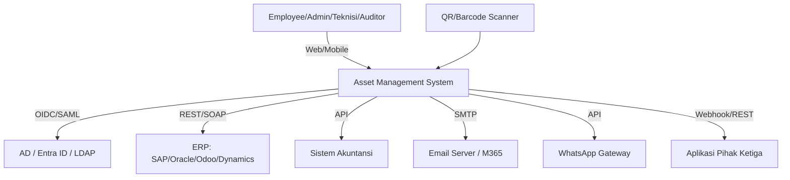
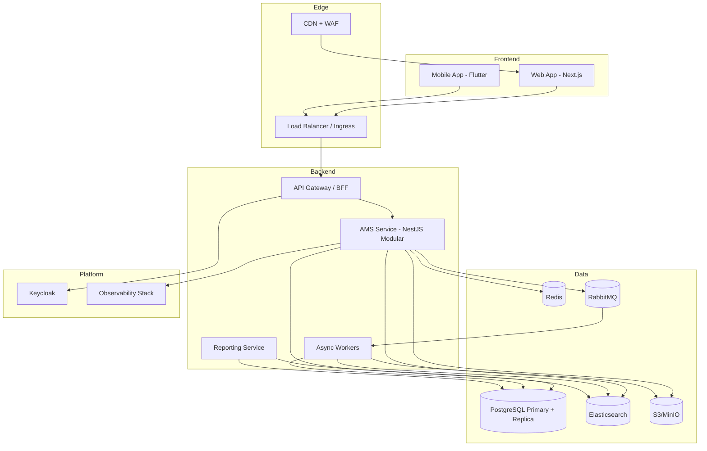
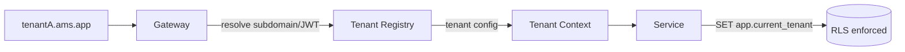
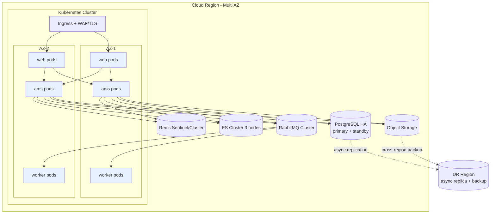
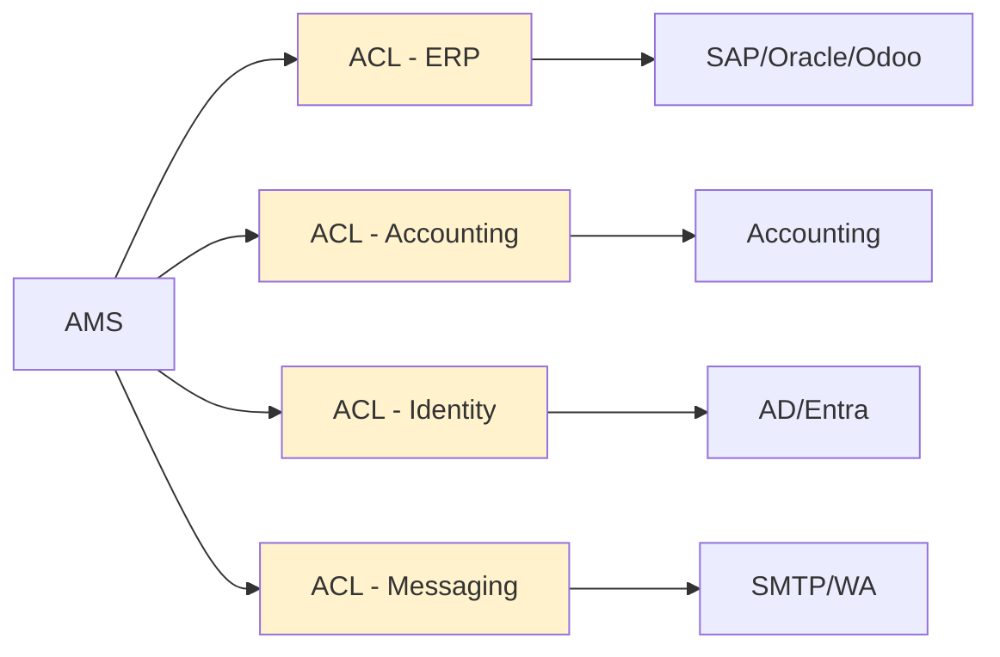

# 02 — Software Architecture Document (SAD)

**Asset Management System (AMS) — Enterprise & SaaS Multi-Tenant**

| | |
|---|---|
| Versi | 1.0 |
| Tanggal | Juli 2026 |
| Acuan | `00-PRD-Analysis.md`, `01-Software-Design-Document.md` |
| Model | C4 Model + arc42 (ringkas) |

---

## 1. Tujuan & Stakeholder
Dokumen ini mendeskripsikan arsitektur sistem: konteks, kontainer, komponen, deployment, strategi multi-tenant, skalabilitas, HA/DR, dan keputusan arsitektur (ADR). Stakeholder: Engineering, DevOps/SRE, Security, Product, QA.

## 2. Architectural Drivers
| Driver | Sumber | Dampak Arsitektur |
|--------|--------|-------------------|
| 500 concurrent, 100k aset, <3s | NFR | Stateless services + autoscaling + cache + index |
| Multi-tenant SaaS | Target | Tenant isolation, RLS, tenant routing, quota |
| Enterprise integrasi | PRD §8 | SSO, ERP/Accounting adapters, REST API publik |
| Security & audit | NFR | Zero-trust, encryption, immutable audit |
| High availability | Enterprise | Multi-AZ, replikasi, DR (RPO/RTO) |

---

## 3. C4 — Level 1: System Context

## 4. C4 — Level 2: Container Diagram

**Kontainer utama:**
| Kontainer | Teknologi | Fungsi |
|-----------|-----------|--------|
| Web App | Next.js | UI web responsif (SSR/CSR) |
| Mobile App | Flutter | Audit scan QR, offline-first |
| API Gateway/BFF | NestJS/Nginx | Routing, auth, rate limit, tenant resolve |
| AMS Service | NestJS | Domain logic 10 modul |
| Async Workers | NestJS + BullMQ | Depresiasi, notifikasi, indexing, export |
| Reporting Service | NestJS | Query berat, export async |
| Keycloak | Keycloak | SSO/OIDC/SAML, MFA |
| PostgreSQL | PG15 | OLTP, RLS multi-tenant |
| Redis | Redis7 | Cache, queue, session, rate-limit |
| Elasticsearch | ES8 | Search & analytics |
| S3/MinIO | S3 | Object storage |
| RabbitMQ | RabbitMQ | Event/async messaging |

## 5. C4 — Level 3: Component (AMS Service)
Komponen = modul pada SDD §4 (`platform`, `identity`, `asset-catalog`, `asset-tracking`, `maintenance`, `finance-audit`, `disposal`, `analytics`, `billing`, `notification`, `shared`). Komunikasi antar-modul via **interface aplikasi** (in-process) dan **event** (async). Saat perlu, modul dapat dipromosikan menjadi microservice terpisah (mis. `analytics`, `notification`).

---

## 6. Strategi Multi-Tenancy

### 6.1 Model Isolasi (Tiered)
| Tier | Model | Untuk |
|------|-------|-------|
| **Standard** | Shared DB + shared schema + `tenant_id` + **RLS** | Mayoritas tenant SaaS |
| **Premium** | Schema-per-tenant (DB sama) | Tenant butuh isolasi lebih |
| **Enterprise** | Database/instance-per-tenant | Compliance/on-prem/residency |

### 6.2 Tenant Routing & Context

- **Tenant Registry**: metadata tenant (tier, region, IdP, plan, feature flags, connection).
- **RLS policy** memaksa `tenant_id = current_setting('app.current_tenant')` pada setiap tabel.
- **Isolasi storage**: prefix `tenants/{tenantId}/` di S3; index terfilter `tenant_id` di ES.

### 6.3 Tenant Onboarding
`Signup → provision (schema/policy/seed master data) → konfigurasi IdP & branding → aktivasi plan → selesai`. Otomatis via `TenantProvisioner` (idempoten, transactional saga).

### 6.4 Noisy-Neighbor & Quota
Rate limit & resource quota per tenant (Redis token bucket); prioritas job queue per tier; connection pool terpisah untuk tenant Enterprise.

---

## 7. Deployment Architecture (Kubernetes, Multi-AZ)

**Environments:** `dev → staging → production`. IaC (Terraform) + GitOps (ArgoCD). Blue-green / canary deploy.

---

## 8. Scalability & Performance
| Teknik | Penerapan |
|--------|-----------|
| Stateless services | Horizontal Pod Autoscaler (CPU/RPS) |
| Caching | Redis (KPI, reference data, sessions) |
| Read scaling | PostgreSQL read-replica untuk reporting |
| Search offload | Elasticsearch untuk pencarian & agregasi |
| Async offload | Queue untuk depresiasi/notif/export |
| DB tuning | Index, partisi tabel besar (`asset_history`, `audit_log`), connection pooling (PgBouncer) |
| CDN | Aset statis & label QR |

**Target kapasitas:** ≥500 concurrent (P95 < 3s), ≥100k aset per tenant, throughput reporting via replica/ES.

---

## 9. Availability & Disaster Recovery
| Aspek | Target/Strategi |
|-------|-----------------|
| Uptime SLA | 99.9% (Enterprise 99.95%) |
| Multi-AZ | Semua kontainer stateless + data store HA |
| Backup | **PITR** WAL + snapshot harian (NFR backup harian) |
| RPO | ≤ 15 menit |
| RTO | ≤ 1 jam |
| DR | Async replica ke region kedua + restore runbook |
| Health | Liveness/readiness probes, circuit breaker, graceful shutdown |

---

## 10. Integration Architecture
- **Anti-Corruption Layer (ACL)** untuk tiap sistem eksternal (ERP, Accounting, IdP).
- **SSO:** Keycloak brokering ke AD/Entra (OIDC/SAML), SCIM provisioning.
- **ERP/Accounting:** outbound sync nilai aset & depresiasi (batch + event); inbound master data (opsional) via connector.
- **Email/WA:** provider adapter dengan retry & DLQ.
- **Public REST API:** untuk pihak ketiga, dengan API key/OAuth2 client credentials, rate-limit per tenant, webhook events.

---

## 11. Observability
- **Logs:** structured JSON → Loki (dengan `tenantId`, `traceId`).
- **Metrics:** Prometheus (RED/USE), dashboard Grafana per tenant/service.
- **Tracing:** OpenTelemetry end-to-end (web → gateway → service → DB).
- **Alerting:** SLO-based (error budget), on-call runbook.
- **Audit:** append-only + ekspor ke SIEM.

---

## 12. Technology Stack (Ringkas)
Lihat `00-PRD-Analysis.md §4.2`. Ringkas: Next.js, Flutter, NestJS, PostgreSQL, Redis, Elasticsearch, S3/MinIO, RabbitMQ, Keycloak, Kubernetes, OpenTelemetry/Prometheus/Grafana/Loki.

---

## 13. Architecture Decision Records (ADR)
| ADR | Keputusan | Alasan | Konsekuensi |
|-----|-----------|--------|-------------|
| ADR-1 | Multi-tenant *shared DB + RLS* default | Efisiensi biaya, skala SaaS | Perlu disiplin RLS & testing isolasi |
| ADR-2 | Modular monolith dulu | Kecepatan delivery, cohesion | Siapkan seams untuk pecah ke microservice |
| ADR-3 | NestJS/TypeScript | TS end-to-end, ekosistem | Perlu tuning Node untuk CPU-bound (offload ke worker) |
| ADR-4 | Keycloak untuk IAM | SSO/SAML/OIDC siap enterprise | Operasional Keycloak (HA) |
| ADR-5 | Elasticsearch untuk search/report | KPI pencarian < 30s | Sinkronisasi index (eventual) |
| ADR-6 | Event-driven + RabbitMQ | Decoupling, audit, async | Kompleksitas eventual consistency |
| ADR-7 | PostgreSQL sebagai source of truth | ACID, RLS, PITR | — |

---

## 14. Risiko Arsitektur & Mitigasi
| Risiko | Mitigasi |
|--------|----------|
| Kebocoran data antar tenant | RLS + test isolasi otomatis + code review guard |
| Node CPU-bound (PDF/QR/report) | Offload ke worker, horizontal scale |
| Ketergantungan integrasi eksternal | ACL, circuit breaker, retry, fallback |
| Lonjakan beban audit akhir bulan | Autoscaling + rate limit + batching |
| Konsistensi index ES | Outbox pattern + rekonsiliasi berkala |
