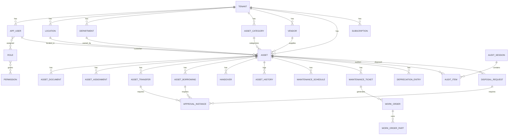

# 03 — Database Design (ERD)

**Asset Management System (AMS) — PostgreSQL 15, Multi-Tenant (RLS)**

| | |
|---|---|
| Versi | 1.0 |
| Tanggal | Juli 2026 |
| Acuan | `01-SDD`, `02-SAD` |
| DBMS | PostgreSQL 15 |

---

## 1. Prinsip Desain Data
- **Multi-tenant:** setiap tabel bisnis memiliki kolom `tenant_id UUID NOT NULL` + **Row-Level Security (RLS)**.
- **Primary key:** `UUID` (v7/ULID untuk ordering) agar aman lintas region & merge.
- **Audit kolom:** `created_at, created_by, updated_at, updated_by, deleted_at` (soft delete bila perlu).
- **Uang:** `NUMERIC(18,2)` + `currency CHAR(3)`.
- **Enum:** via `CHECK` / lookup table agar portable.
- **Immutable log:** `asset_history`, `audit_log`, `depreciation_entry` bersifat append-only.
- **Naming:** `snake_case`, tabel plural.

---

## 2. Entity Relationship Diagram (Inti)



---

## 3. Definisi Tabel

### 3.1 Platform & Tenancy

**`tenant`** (tidak ber-RLS; root registry)
| Kolom | Tipe | Ket |
|-------|------|-----|
| id | UUID PK | |
| name | VARCHAR(150) | |
| slug | VARCHAR(63) UNIQUE | subdomain |
| tier | VARCHAR(20) | standard/premium/enterprise |
| status | VARCHAR(20) | active/suspended/trial |
| region | VARCHAR(30) | |
| settings | JSONB | branding, timezone, currency, feature flags |
| idp_config | JSONB | OIDC/SAML per tenant |
| created_at/updated_at | TIMESTAMPTZ | |

**`app_user`**
| Kolom | Tipe | Ket |
|-------|------|-----|
| id | UUID PK | |
| tenant_id | UUID FK→tenant | RLS |
| external_id | VARCHAR(150) | subject dari IdP (SSO) |
| email | CITEXT | unik per tenant |
| full_name | VARCHAR(150) | |
| status | VARCHAR(20) | active/inactive/invited |
| mfa_enabled | BOOLEAN | |
| last_login_at | TIMESTAMPTZ | |
| audit cols | | |
| UNIQUE | (tenant_id, email) | |

**`role`** `(id, tenant_id, code, name, is_system)` — 7 role PRD sebagai seed system role.
**`permission`** `(id, code, description)` — global, format `resource:action`.
**`role_permission`** `(role_id, permission_id)` PK gabungan.
**`user_role`** `(user_id, role_id)` PK gabungan.

**`location`** `(id, tenant_id, code, name, type[branch/building/floor/room], parent_id self-FK, address)` — hierarkis.
**`department`** `(id, tenant_id, code, name, manager_user_id FK→app_user)`.
**`asset_category`** `(id, tenant_id, code, name, default_useful_life_years, default_depreciation_method)`.
**`vendor`** `(id, tenant_id, code, name, contact, email, phone, address)`.

### 3.2 Module 1 — Asset Catalog

**`asset`** (aggregate root)
| Kolom | Tipe | Ket / Requirement |
|-------|------|-------------------|
| id | UUID PK | |
| tenant_id | UUID FK | RLS |
| asset_code | VARCHAR(50) | unik per tenant (`FR-M1-1`) |
| name | VARCHAR(200) | |
| category_id | UUID FK→asset_category | |
| brand | VARCHAR(100) | |
| model | VARCHAR(100) | |
| serial_number | VARCHAR(120) | |
| asset_type | VARCHAR(50) | |
| purchase_date | DATE | |
| purchase_price | NUMERIC(18,2) | |
| salvage_value | NUMERIC(18,2) | default 0 |
| currency | CHAR(3) | default IDR |
| vendor_id | UUID FK→vendor | |
| warranty_expiry | DATE | |
| useful_life_years | INT | |
| depreciation_method | VARCHAR(30) | default STRAIGHT_LINE |
| book_value | NUMERIC(18,2) | dihitung |
| location_id | UUID FK→location | |
| department_id | UUID FK→department | |
| custodian_user_id | UUID FK→app_user | PIC |
| status | VARCHAR(20) | DRAFT/ACTIVE/IN_MAINTENANCE/BORROWED/UNDER_REVIEW/RETIRED/DISPOSED |
| qr_url, barcode_url | TEXT | label (`FR-M1-3/4`) |
| audit cols | | |
| UNIQUE | (tenant_id, asset_code) | |
| INDEX | (tenant_id, status), (tenant_id, category_id), (tenant_id, location_id), serial_number | |

**`asset_document`** `(id, tenant_id, asset_id FK, doc_type[invoice/po/warranty/manual/photo/other], file_key, file_name, mime, size, uploaded_by, created_at)` (`FR-M1-2`).

### 3.3 Module 2 — Tracking

**`asset_assignment`** `(id, tenant_id, asset_id, assignee_type[user/department/location], assignee_id, assigned_by, assigned_at, released_at, note)` (`FR-M2-1`).
**`asset_transfer`** `(id, tenant_id, asset_id, from_location_id, to_location_id, from_department_id, to_department_id, reason, status[REQUESTED/APPROVED/REJECTED/TRANSFERRED/CONFIRMED], requested_by, approval_instance_id, created_at)` (`FR-M2-2`).
**`asset_borrowing`** `(id, tenant_id, asset_id, borrower_user_id, borrow_date, due_return_date, actual_return_date, condition_before, condition_after, status[REQUESTED/APPROVED/BORROWED/RETURNED/OVERDUE], approval_instance_id)` (`FR-M2-3`).
**`handover`** `(id, tenant_id, asset_id, ref_type[borrowing/transfer/assignment], ref_id, from_user_id, to_user_id, signature_key, photo_keys JSONB, condition_note, signed_at)` (`FR-M2-4`).
**`asset_history`** (append-only) `(id, tenant_id, asset_id, event_type, actor_user_id, payload JSONB, occurred_at)` (`FR-M2-5`). INDEX `(tenant_id, asset_id, occurred_at DESC)`; **partisi** per bulan.

### 3.4 Module 3 — Maintenance

**`maintenance_schedule`** `(id, tenant_id, asset_id, frequency[MONTHLY/QUARTERLY/SEMESTER/ANNUAL/CUSTOM], interval_days, next_due_date, last_done_date, active)` (`FR-M3-1`).
**`maintenance_ticket`** `(id, tenant_id, asset_id, reporter_user_id, problem, severity[LOW/MEDIUM/HIGH/CRITICAL], status[OPEN/ASSIGNED/IN_PROGRESS/COMPLETED/CLOSED], type[PREVENTIVE/CORRECTIVE], created_at)` (`FR-M3-2`).
**`work_order`** `(id, tenant_id, ticket_id, asset_id, technician_user_id, location_id, complaint, estimated_cost, actual_cost, started_at, completed_at, status)` (`FR-M3-3`).
**`work_order_part`** `(id, tenant_id, work_order_id, part_name, qty, unit_cost)`.
**`maintenance_history`** `(id, tenant_id, asset_id, work_order_id, technician_user_id, date, type, parts JSONB, cost, attachment_keys JSONB)` (`FR-M3-4`).
**`ticket_attachment`** `(id, tenant_id, ticket_id, file_key, mime, created_at)`.

### 3.5 Module 4 — Depreciation & Audit

**`depreciation_entry`** (append-only) `(id, tenant_id, asset_id, period_year, period_month, method, opening_value, depreciation_amount, accumulated, book_value, created_at)` (`FR-M4-1`). UNIQUE `(tenant_id, asset_id, period_year, period_month)`.
**`audit_session`** `(id, tenant_id, name, scope JSONB[location/department], started_by, started_at, closed_at, status[PLANNED/IN_PROGRESS/CLOSED])` (`FR-M4-2`).
**`audit_item`** `(id, tenant_id, audit_session_id, asset_id, auditor_user_id, status[FOUND/MISSING/DAMAGED/RELOCATED], expected_location_id, actual_location_id, condition_note, photo_keys JSONB, audited_at)` (`FR-M4-2/3`).

### 3.6 Module 5 — Disposal

**`disposal_request`** `(id, tenant_id, asset_id, reason[DAMAGED/SOLD/LOST/EXPIRED/DONATION], status[REQUESTED/UNDER_REVIEW/APPROVED/REJECTED/DISPOSED/ARCHIVED], sale_value, requested_by, approval_instance_id, disposed_at)` (`FR-M5-1/2`).
**`disposal_document`** `(id, tenant_id, disposal_request_id, doc_type[berita_acara/photo/approval/other], file_key, created_at)` (`FR-M5-3`).

### 3.7 Shared — Approval, Notification, Audit, Billing

**`approval_workflow`** `(id, tenant_id, entity_type[transfer/borrowing/disposal], name, active)`.
**`approval_step`** `(id, tenant_id, workflow_id, step_order, approver_role_id, condition JSONB)` — mendukung **multi-level**.
**`approval_instance`** `(id, tenant_id, workflow_id, entity_type, entity_id, current_step, status[PENDING/APPROVED/REJECTED], created_at)`.
**`approval_action`** `(id, tenant_id, instance_id, step_order, approver_user_id, decision[APPROVE/REJECT], note, acted_at)`.
**`notification`** `(id, tenant_id, user_id, channel[EMAIL/WA/IN_APP], template_code, payload JSONB, status[PENDING/SENT/FAILED/READ], sent_at, created_at)`.
**`notification_template`** `(id, tenant_id, code, channel, locale, subject, body)`.
**`audit_log`** (append-only) `(id, tenant_id, actor_user_id, action, resource_type, resource_id, before JSONB, after JSONB, ip, user_agent, trace_id, created_at)` (`NFR-5`). **Partisi** per bulan.
**`subscription`** `(id, tenant_id, plan_code, status, current_period_start, current_period_end, seats, asset_quota)`; **`usage_metric`** `(id, tenant_id, metric[assets/users/storage], value, recorded_at)`; **`invoice`** `(id, tenant_id, number, amount, currency, status, issued_at, due_at)`.

---

## 4. Row-Level Security (RLS)

Diterapkan pada **semua tabel ber-`tenant_id`**:
```sql
ALTER TABLE asset ENABLE ROW LEVEL SECURITY;
ALTER TABLE asset FORCE ROW LEVEL SECURITY;

CREATE POLICY tenant_isolation ON asset
  USING (tenant_id = current_setting('app.current_tenant')::uuid)
  WITH CHECK (tenant_id = current_setting('app.current_tenant')::uuid);
```
- Aplikasi menyetel `SET app.current_tenant = '<uuid>'` di awal transaksi (dari Tenant Context).
- Role DB aplikasi **bukan** superuser/owner (agar RLS tidak ter-bypass).
- Migrasi otomatis meng-generate policy untuk tiap tabel bisnis.

---

## 5. Indexing & Performance
| Tabel | Index kunci |
|-------|-------------|
| asset | `(tenant_id, status)`, `(tenant_id, category_id)`, `(tenant_id, location_id)`, `(tenant_id, custodian_user_id)`, `GIN(name gin_trgm_ops)` |
| asset_history | `(tenant_id, asset_id, occurred_at DESC)` + partisi bulanan |
| audit_log | `(tenant_id, created_at)` + partisi bulanan |
| depreciation_entry | UNIQUE `(tenant_id, asset_id, period_year, period_month)` |
| maintenance_ticket | `(tenant_id, status)`, `(tenant_id, asset_id)` |
| notification | `(tenant_id, user_id, status)` |

- **Partisi range** (bulanan) untuk tabel append-only besar.
- **PgBouncer** connection pooling.
- Kolom pencarian cepat direplikasi ke **Elasticsearch** (`asset_index`).

---

## 6. Data Lifecycle & Retensi
| Data | Retensi | Catatan |
|------|---------|---------|
| audit_log | ≥ 1 tahun (config per tenant/compliance) | append-only, archived ke cold storage |
| asset_history | selama aset ada + arsip | |
| notification | 90 hari | purge job |
| disposed asset | diarsipkan, tidak dihapus | jejak audit |
| backup | PITR + snapshot harian (`NFR-7`) | lihat SAD §9 |

---

## 7. Seed Data (per tenant baru)
- 7 role sistem (Super Admin, Asset Administrator, Procurement, Teknisi, Auditor, Department Manager, Employee) + mapping permission.
- Kategori aset default, lokasi root, template notifikasi (ID/EN), workflow approval default (transfer/borrowing/disposal).

---

## 8. Contoh DDL (ekstrak `asset`)
```sql
CREATE TABLE asset (
  id UUID PRIMARY KEY DEFAULT gen_random_uuid(),
  tenant_id UUID NOT NULL REFERENCES tenant(id),
  asset_code VARCHAR(50) NOT NULL,
  name VARCHAR(200) NOT NULL,
  category_id UUID NOT NULL REFERENCES asset_category(id),
  brand VARCHAR(100), model VARCHAR(100), serial_number VARCHAR(120),
  asset_type VARCHAR(50),
  purchase_date DATE, purchase_price NUMERIC(18,2), salvage_value NUMERIC(18,2) DEFAULT 0,
  currency CHAR(3) DEFAULT 'IDR',
  vendor_id UUID REFERENCES vendor(id),
  warranty_expiry DATE, useful_life_years INT,
  depreciation_method VARCHAR(30) DEFAULT 'STRAIGHT_LINE',
  book_value NUMERIC(18,2),
  location_id UUID REFERENCES location(id),
  department_id UUID REFERENCES department(id),
  custodian_user_id UUID REFERENCES app_user(id),
  status VARCHAR(20) NOT NULL DEFAULT 'DRAFT',
  qr_url TEXT, barcode_url TEXT,
  created_at TIMESTAMPTZ DEFAULT now(), created_by UUID,
  updated_at TIMESTAMPTZ DEFAULT now(), updated_by UUID,
  deleted_at TIMESTAMPTZ,
  CONSTRAINT uq_asset_code UNIQUE (tenant_id, asset_code)
);
CREATE INDEX idx_asset_tenant_status ON asset(tenant_id, status);
```
