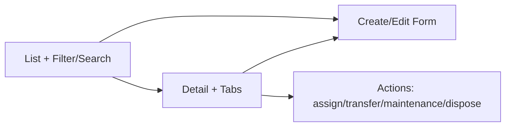

# 05 — UI/UX Design System

**Asset Management System (AMS) — Web (Next.js) + Mobile (Flutter)**

| | |
|---|---|
| Versi | 1.0 |
| Tanggal | Juli 2026 |
| Basis | shadcn/ui + Radix + TailwindCSS (web), Material 3 (mobile) |
| Acuan | `01-SDD`, `06-User-Flow` |

---

## 1. Prinsip Desain (UX)
1. **Clarity first** — data aset padat; utamakan keterbacaan & hierarki.
2. **Efficiency** — alur cepat untuk task berulang (input aset, scan audit, approval).
3. **Consistency** — pola sama lintas modul (list-detail-form).
4. **Feedback** — status jelas (loading, success, error, empty).
5. **Accessibility** — WCAG 2.1 AA.
6. **Multi-tenant branding** — logo, warna primary, nama tenant dapat dikustom (white-label).
7. **Responsive & mobile-ready** — dari desktop admin sampai audit di lapangan.

---

## 2. Design Tokens

### 2.1 Warna (light; tersedia dark mode)
| Token | Nilai | Penggunaan |
|-------|-------|-----------|
| `--color-primary` | `#2563EB` | aksi utama, brand (override per tenant) |
| `--color-primary-fg` | `#FFFFFF` | teks di atas primary |
| `--color-secondary` | `#64748B` | aksi sekunder |
| `--color-success` | `#16A34A` | active/found/completed |
| `--color-warning` | `#D97706` | due/overdue ringan |
| `--color-danger` | `#DC2626` | missing/damaged/error |
| `--color-info` | `#0891B2` | informasi |
| `--color-bg` | `#F8FAFC` | background app |
| `--color-surface` | `#FFFFFF` | card/panel |
| `--color-border` | `#E2E8F0` | garis |
| `--color-text` | `#0F172A` | teks utama |
| `--color-text-muted` | `#64748B` | teks sekunder |

**Status aset (semantic mapping):** Active=success, In Maintenance=warning, Borrowed=info, Under Review=secondary, Retired=muted, Disposed=danger-outline. Audit: Found=success, Missing=danger, Damaged=warning, Relocated=info.

### 2.2 Tipografi
- Font: **Inter** (web), **Roboto** (mobile).
- Skala: `xs 12 / sm 14 / base 16 / lg 18 / xl 20 / 2xl 24 / 3xl 30 / 4xl 36`.
- Heading tebal 600–700; body 400–500; angka finansial `tabular-nums`.

### 2.3 Spacing & Layout
- Grid 4px: `1=4, 2=8, 3=12, 4=16, 6=24, 8=32`.
- Container maks `1280px`; sidebar `256px`; konten `padding 24`.
- Radius: `sm 6 / md 8 / lg 12 / full`. Shadow: `sm/md/lg`.

### 2.4 Breakpoints
`sm 640 / md 768 / lg 1024 / xl 1280 / 2xl 1536`. Mobile-first.

---

## 3. Komponen Library (Atomic)

### 3.1 Atoms
Button (primary/secondary/ghost/destructive, size sm/md/lg, loading), Input, Textarea, Select, Combobox, Checkbox, Radio, Switch, Badge/Tag (status), Avatar, Icon (Lucide), Tooltip, Spinner, Skeleton.

### 3.2 Molecules
Form Field (label+input+error+hint), Search Bar, Filter Chip, Date Range Picker, File Upload (drag-drop, preview, progress), Stat Card (KPI), Status Badge, Pagination, Breadcrumb, Toast/Alert.

### 3.3 Organisms
| Komponen | Fungsi |
|----------|--------|
| **Data Table** | list aset/ticket/audit: sort, filter, column toggle, bulk action, pagination server-side, export |
| **App Shell** | sidebar + topbar + content, tenant branding, role-based menu |
| **Detail Drawer/Page** | header aset, tabs (Info, History, Maintenance, Documents, Depreciation) |
| **Wizard/Stepper** | input aset multi-step, disposal workflow |
| **Approval Card** | ringkasan + Approve/Reject |
| **Timeline** | asset history & audit trail |
| **QR Scanner** | (mobile) kamera + overlay |
| **Chart** | KPI (donut, bar, line) via Recharts |
| **Empty/Error/Loading States** | konsisten seluruh app |

### 3.4 Contoh Spesifikasi Button
```
Primary  : bg primary, text primary-fg, hover darken 8%, focus ring 2px, disabled 40% + no-pointer
Destructive: bg danger; konfirmasi untuk aksi merusak (delete, dispose)
States   : default / hover / active / focus-visible / disabled / loading(spinner + label "Memproses...")
Min touch target mobile: 44x44px
```

---

## 4. Pola Halaman (Patterns)

### 4.1 List → Detail → Form (CRUD standar)


### 4.2 Layout App Shell
```
+--------------------------------------------------------+
| Topbar: [Tenant Logo] Search      🔔  Profil(role)     |
+---------+----------------------------------------------+
| Sidebar | Breadcrumb                                   |
|  Dashboard                                             |
|  Assets |  <Konten: Table / Detail / Form>             |
|  Tracking                                              |
|  Maintenance                                           |
|  Audit  |                                              |
|  Disposal                                              |
|  Reports|                                              |
|  Admin  |                                              |
+---------+----------------------------------------------+
```
Menu ditampilkan sesuai **role** (RBAC-aware navigation).

---

## 5. Layar Kunci (Key Screens)

| Layar | Ringkasan konten |
|-------|------------------|
| **Dashboard** | KPI cards (Total/Active/Maintenance/Borrowed/Retired), grafik nilai aset & penyusutan, maintenance due/overdue, progress audit |
| **Asset List** | Data table + filter (kategori/lokasi/status), search, tombol "Tambah Aset", export |
| **Asset Detail** | Header (foto, kode, QR, status), tabs Info/History/Maintenance/Documents/Depreciation; actions |
| **Asset Form (Wizard)** | Step: Data Umum → Finansial → Lokasi/Custodian → Dokumen → Review → Generate Label |
| **Transfer/Borrow** | Form + preview approval chain |
| **Maintenance Board** | Kanban ticket (Open→Assigned→In Progress→Completed→Closed) |
| **Work Order** | Detail teknisi, sparepart, biaya, lampiran |
| **Audit (Mobile)** | Scan QR → data → status Found/Missing/Damaged/Relocated → foto → submit; indikator offline/sync |
| **Disposal** | Wizard request → dokumen → status |
| **Reports** | Pilih jenis, filter periode, preview, export async |
| **Approvals Inbox** | Daftar approval + aksi cepat |
| **Admin** | Users/Roles, Locations, Departments, Categories, Vendors, Tenant Settings/Branding, Billing |

---

## 6. Mobile App (Flutter) — Fokus Audit & Lapangan
- **Home:** tugas audit hari ini, aset yang di-assign.
- **Scanner:** kamera full-screen, auto-detect QR, verifikasi signature, tampil kartu aset.
- **Audit Form:** status + kondisi + foto (kamera), simpan **offline** → badge "Menunggu sinkron".
- **Sync:** indikator jaringan, tombol "Sinkronkan", resolusi konflik.
- **Ticketing:** Employee lapor kerusakan + foto.
- Material 3, gesture besar, kontras tinggi (dipakai di gudang/lapangan).

---

## 7. Aksesibilitas (WCAG 2.1 AA)
- Kontras teks ≥ 4.5:1; komponen non-teks ≥ 3:1.
- Navigasi keyboard penuh, `focus-visible` jelas.
- ARIA role/label pada komponen interaktif & data table.
- Form: label eksplisit, error terkait `aria-describedby`.
- Status tidak hanya bergantung warna (ada ikon/teks).
- Dukungan reduce-motion, ukuran font relatif (rem).

---

## 8. Konten & i18n
- Bahasa: ID (default) & EN, string via i18n (`react-i18next` / `intl`).
- Format tanggal/angka/mata uang per locale & timezone tenant.
- Tone: ringkas, profesional, konsisten (glossary istilah aset).

---

## 9. Theming Multi-Tenant (White-Label)
- Tenant dapat set: logo, warna primary, nama aplikasi, favicon.
- Token warna di-inject via CSS variables saat runtime (dari `tenant.settings`).
- Fallback ke tema default AMS bila tidak dikonfigurasi.

---

## 10. Deliverables Desain
- **Figma library**: tokens, komponen, layar kunci, prototype alur utama.
- **Storybook**: komponen web terdokumentasi + a11y addon + visual regression (Chromatic).
- **Design-to-code**: token disinkron (Style Dictionary) ke Tailwind config.
- Handoff: spesifikasi state, spacing, dan interaksi tiap komponen.
