# 06 — User Flow

**Asset Management System (AMS)**

| | |
|---|---|
| Versi | 1.0 |
| Tanggal | Juli 2026 |
| Acuan | PRD §7 Workflow Utama, `01-SDD`, `05-UIUX` |

Dokumen ini memetakan alur pengguna end-to-end per role & modul. Notasi: kotak = layar/aksi, wajik = keputusan.

---

## 1. Peta Peran → Kapabilitas

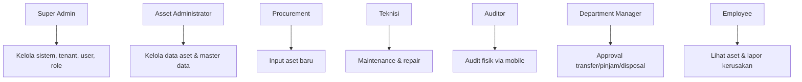

---

## 2. Autentikasi & Onboarding Tenant

### 2.1 Login (SSO)
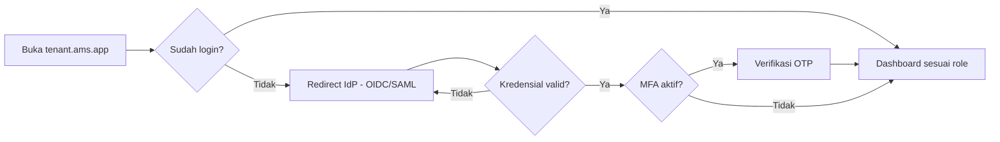

### 2.2 Tenant Onboarding (SaaS)
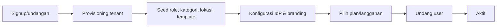

---

## 3. Module 1 — Procurement & Onboarding (Procurement)

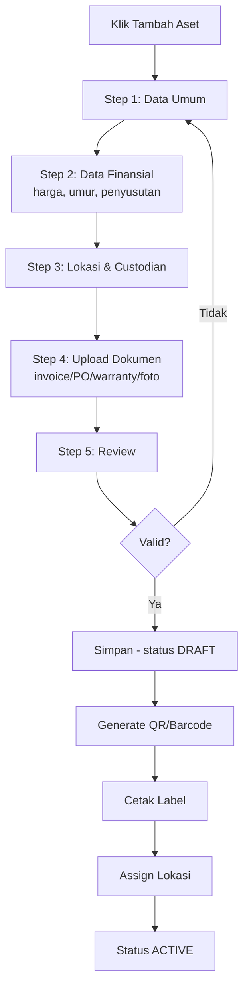

---

## 4. Module 2 — Tracking & Assignment

### 4.1 Assignment (Asset Admin)
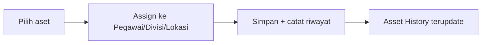

### 4.2 Transfer / Mutasi (dengan Approval)
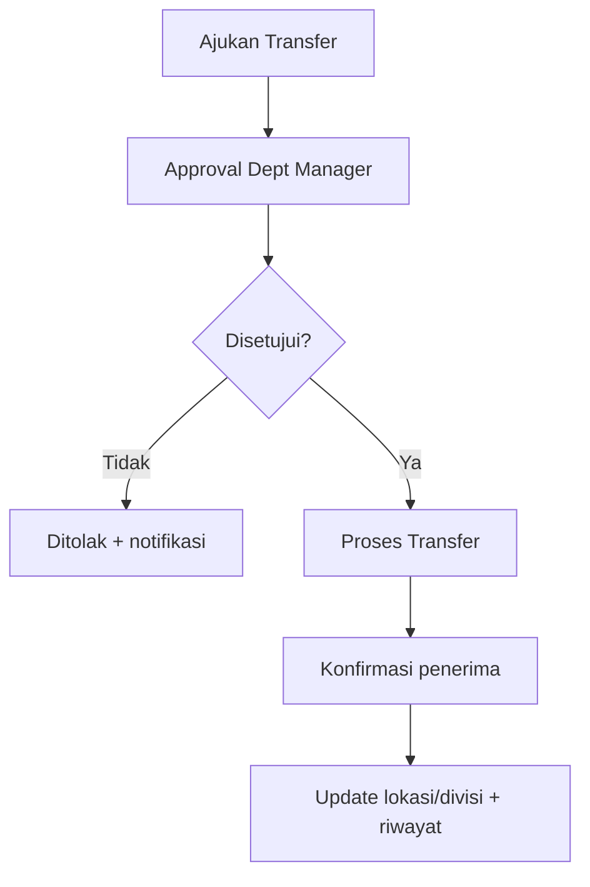

### 4.3 Peminjaman & Pengembalian (Employee + Manager)
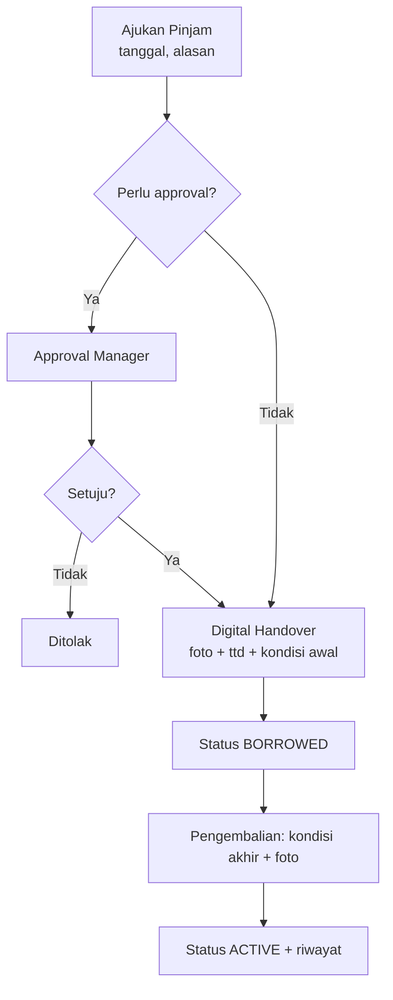

---

## 5. Module 3 — Maintenance

### 5.1 Corrective (Employee lapor → Teknisi)
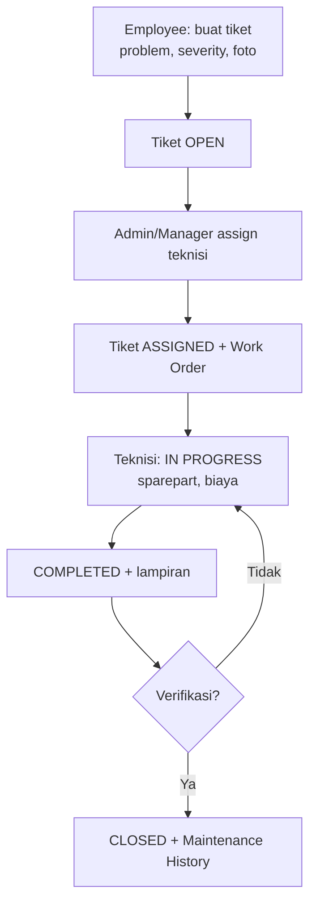

### 5.2 Preventive (Terjadwal otomatis)
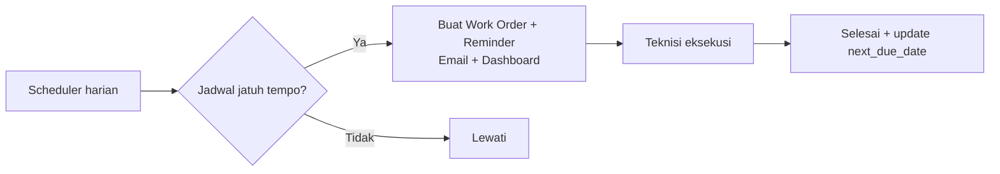

---

## 6. Module 4 — Depreciation & Audit

### 6.1 Depresiasi (Otomatis)
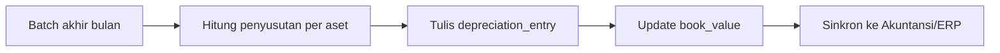

### 6.2 Audit Fisik (Auditor — Mobile)
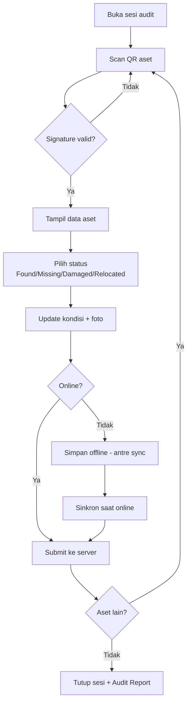

---

## 7. Module 5 — Disposal (Request → Approval → Archive)
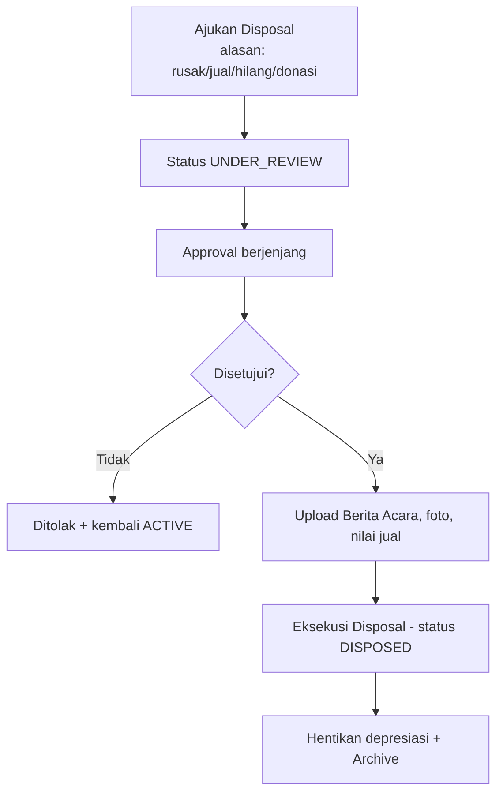

---

## 8. Module 6 & 7 — Dashboard & Reporting

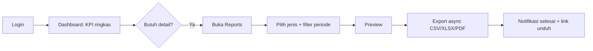

---

## 9. Approval Inbox (Department Manager)
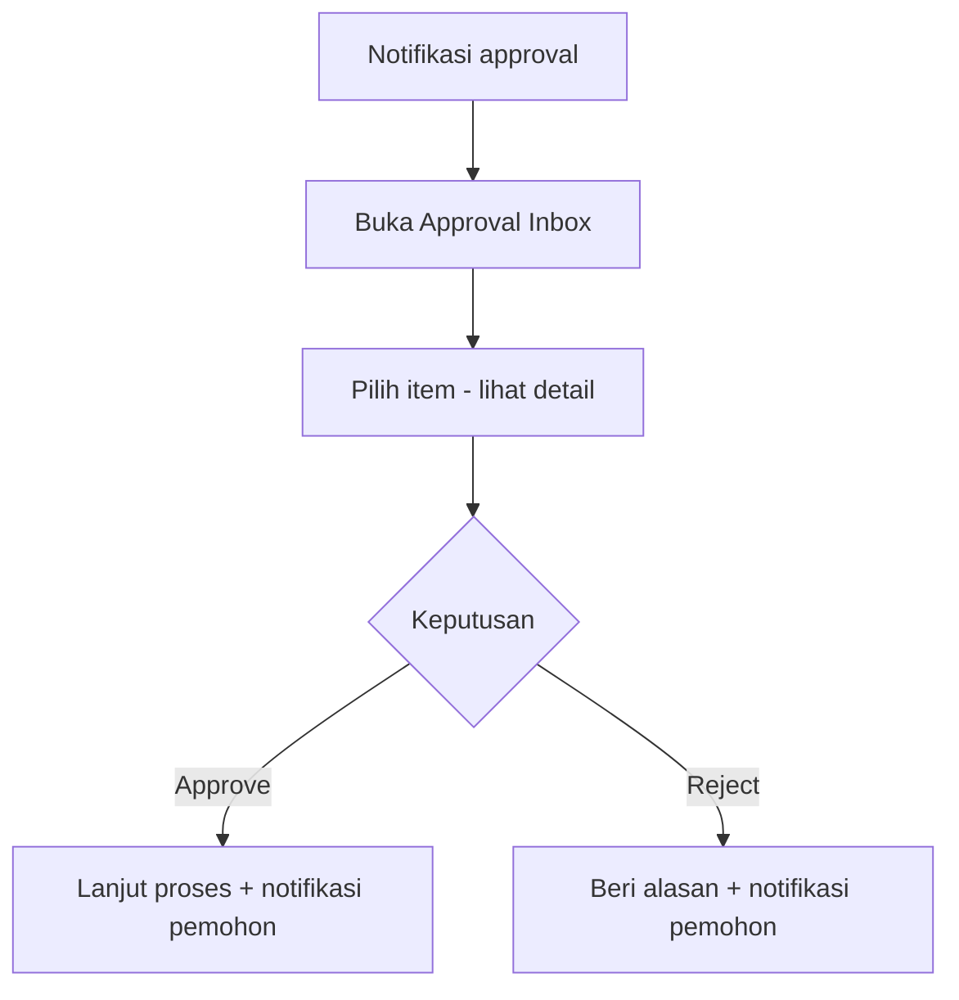

---

## 10. Employee — Self Service
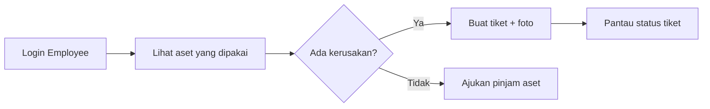

---

## 11. Ringkasan Titik Kritis UX
| Alur | Risiko UX | Mitigasi |
|------|-----------|----------|
| Input aset | Form panjang | Wizard multi-step + autosave draft |
| Audit lapangan | Sinyal buruk | Offline-first + indikator sync |
| Approval | Bottleneck | Notifikasi + inbox + aksi cepat |
| Reporting besar | Lama | Export async + notifikasi selesai |
| Scan QR | Salah/rusak | Fallback input kode manual |
