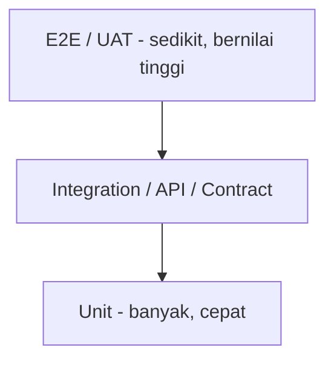
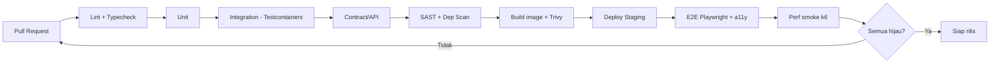

# 07 — Testing Plan

**Asset Management System (AMS) — Enterprise & SaaS Multi-Tenant**

| | |
|---|---|
| Versi | 1.0 |
| Tanggal | Juli 2026 |
| Acuan | Semua dokumen 00–06, 08 |
| Standar | ISTQB, IEEE 829 |

---

## 1. Tujuan & Ruang Lingkup
Memastikan AMS memenuhi seluruh **Functional Requirement (FR)** dan **Non-Functional Requirement (NFR)** PRD, dengan penekanan khusus pada **isolasi multi-tenant** dan **keamanan enterprise**. Mencakup pengujian web, mobile, API, integrasi, performa, keamanan, dan UAT.

## 2. Strategi & Piramida Pengujian

| Level | Cakupan | Tools | Target |
|-------|---------|-------|--------|
| **Unit** | domain logic (depresiasi, state machine, generator kode, RBAC) | Jest (BE), Vitest (FE), flutter_test | Coverage ≥ 80% domain |
| **Integration** | service ↔ DB (RLS), queue, cache | Jest + Testcontainers (PostgreSQL/Redis/RabbitMQ) | Semua repo & event |
| **Contract/API** | kontrak OpenAPI | Pact / Dredd / Schemathesis | 100% endpoint |
| **E2E Web** | alur user kunci | Playwright | Alur kritikal |
| **E2E Mobile** | audit scan/offline | Flutter integration_test / Appium | Alur audit |
| **Performance** | NFR beban | k6 / JMeter | 500 concurrent, <3s P95 |
| **Security** | OWASP | ZAP, Semgrep, Trivy, dependency scan | Zero high/critical |
| **UAT** | validasi bisnis | Manual per role | Sign-off stakeholder |

---

## 3. Test Environments
| Env | Tujuan | Data |
|-----|--------|------|
| Local | dev + unit/integration (Testcontainers) | ephemeral |
| CI | otomatis tiap PR | seeded fixtures |
| Staging | E2E, performa, UAT | data mirip produksi (anonim) |
| Production | smoke test + synthetic monitoring | real |

Minimal **2 tenant uji** (`tenant-A`, `tenant-B`) untuk verifikasi isolasi.

---

## 4. Traceability Matrix (Requirement → Test)

| Req | Deskripsi | Jenis Uji | Contoh Test Case |
|-----|-----------|-----------|------------------|
| FR-M1-1 | Input data aset | Unit/API/E2E | TC-A01 create asset valid; TC-A02 field wajib kosong → 422 |
| FR-M1-2 | Upload dokumen | API/E2E | TC-A03 upload invoice; TC-A04 MIME/size invalid ditolak |
| FR-M1-3 | Generate QR/Barcode | Unit/API | TC-A05 QR ter-generate; TC-A06 signature valid |
| FR-M1-4 | Asset label | E2E | TC-A07 label berisi kode+QR |
| FR-M2-1 | Assignment | API/E2E | TC-B01 assign & riwayat tercatat |
| FR-M2-2 | Transfer + approval | E2E | TC-B02 transfer butuh approval; TC-B03 reject |
| FR-M2-3 | Borrowing | E2E | TC-B04 pinjam & kembali; TC-B05 overdue |
| FR-M2-4 | Digital handover | E2E | TC-B06 ttd+foto tersimpan |
| FR-M2-5 | Asset history | Integration | TC-B07 semua event tercatat |
| FR-M3-1 | Preventive schedule | Unit/Integration | TC-C01 reminder jadwal jatuh tempo |
| FR-M3-2 | Corrective ticket | E2E | TC-C02 lifecycle Open→Closed |
| FR-M3-3 | Work order | E2E | TC-C03 sparepart+biaya |
| FR-M3-4 | Maintenance history | Integration | TC-C04 riwayat lengkap |
| FR-M4-1 | Depreciation | Unit | TC-D01 straight-line akurat; TC-D02 book value; TC-D03 idempoten per periode |
| FR-M4-2 | Audit mobile | E2E Mobile | TC-D04 scan→submit; TC-D05 offline sync |
| FR-M4-3 | Audit report | API | TC-D06 rekap found/missing/damaged |
| FR-M5-1 | Disposal workflow | E2E | TC-E01 request→approve→dispose |
| FR-M5-2 | Status lifecycle | Unit | TC-E02 transisi status valid |
| FR-M5-3 | Dokumen disposal | API | TC-E03 berita acara tersimpan |
| FR-M6 | Dashboard KPI | API/E2E | TC-F01 angka KPI sesuai data |
| FR-M7 | Reporting | API | TC-G01 tiap report + export |
| NFR-1 | Response <3s | Performance | TC-P01 P95 <3s @500 users |
| NFR-2 | 500 concurrent | Performance | TC-P02 stabil tanpa error |
| NFR-3 | 100k aset | Performance | TC-P03 list/search skala |
| NFR-4 | RBAC | Security | TC-S01 akses lintas-role ditolak |
| NFR-5 | Audit log | Integration | TC-S02 setiap write tercatat |
| NFR-6 | Encryption | Security | TC-S03 TLS; TC-S04 data at-rest terenkripsi |
| NFR-7 | Backup | DR drill | TC-S05 restore PITR |
| **MT-1** | **Isolasi tenant** | Security/Integration | TC-MT01 user A tak bisa akses data B; TC-MT02 RLS enforced; TC-MT03 file storage terpisah |

---

## 5. Skenario Uji Kritis (detail)

### 5.1 Multi-Tenant Isolation (WAJIB)
- **TC-MT01:** Token tenant A memanggil `GET /assets/{idMilikB}` → `404/403`, bukan data B.
- **TC-MT02:** Query langsung tanpa `app.current_tenant` → RLS mengembalikan 0 baris.
- **TC-MT03:** Presigned URL file tenant A tidak dapat mengakses objek tenant B.
- **TC-MT04:** Kebocoran via search (Elasticsearch) — filter `tenant_id` wajib.

### 5.2 Depreciation (akurasi finansial)
- **TC-D01:** aset 12.000.000, salvage 0, umur 4th → penyusutan bulanan 250.000; setelah 12 bln akumulasi 3.000.000; book value 9.000.000.
- **TC-D03:** menjalankan batch dua kali untuk periode sama tidak menggandakan entri (idempotent).

### 5.3 State Machine
- Transisi ilegal (mis. `DISPOSED → ACTIVE`) ditolak `409 INVALID_STATE`.

### 5.4 Offline Audit Sync
- Submit offline lalu online → data tersinkron, konflik ditangani (last-write + log), tidak dobel (idempotency `clientId`).

---

## 6. Performance Testing (NFR)
| Skenario | Beban | Kriteria Lulus |
|----------|-------|----------------|
| Browse aset | 500 VU | P95 < 3s, error < 1% |
| Search 100k aset | 200 VU | P95 < 3s (via ES) |
| Depreciation batch | 100k aset | selesai < window, tanpa lock berlebih |
| Report export besar | 50 job paralel | async, tidak blok API |
| Audit sync burst | akhir bulan | throughput stabil |
Tools: **k6** (API), **Lighthouse** (web vitals). Profiling + APM (OpenTelemetry).

## 7. Security Testing
- **SAST:** Semgrep/CodeQL tiap PR. **DAST:** OWASP ZAP di staging.
- **Dependency & container scan:** Trivy, npm/pnpm audit.
- **Pen-test** (pihak ketiga) sebelum rilis mayor.
- Checklist **OWASP Top 10** + **OWASP ASVS**; fokus IDOR (tenant/asset), authz, injeksi. Detail kontrol di `08-Security-Design.md`.

## 8. Accessibility & Compatibility
- **a11y:** axe-core di CI (Storybook + Playwright), audit WCAG 2.1 AA.
- **Cross-browser:** Chrome, Edge, Firefox, Safari (BrowserStack).
- **Mobile:** Android & iOS (matriks device), responsive web.

---

## 9. Test Data Management
- Fixtures & factory (per modul) dengan `tenant_id` eksplisit.
- Data staging **di-anonimkan** (PII masking).
- Seed 2 tenant + dataset 100k aset (sintetis) untuk performa.

## 10. Automation & CI/CD Gates

**Quality gates:** build gagal bila coverage domain < 80%, ada high/critical vuln, atau E2E kritikal merah.

## 11. Entry / Exit Criteria
- **Entry:** fitur code-complete, unit lulus, env siap, test data tersedia.
- **Exit:** 100% test case kritikal lulus, 0 defect Blocker/Critical terbuka, NFR terpenuhi, UAT sign-off, traceability 100% tercakup.

## 12. Defect Management
Severity: Blocker/Critical/Major/Minor/Trivial. SLA triage 1×24 jam untuk Critical. Tracking di issue tracker + link ke test case & requirement.

## 13. Risiko & Mitigasi
| Risiko | Mitigasi |
|--------|----------|
| Kebocoran antar tenant | Suite isolasi wajib + gating |
| Data performa tidak realistis | Generator 100k aset sintetis |
| Flaky E2E | retries + test id stabil + isolasi data |
| Integrasi eksternal tak tersedia | contract test + mock/sandbox |
