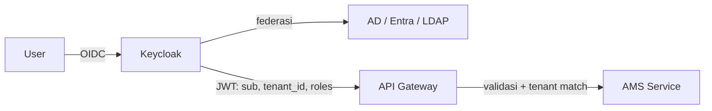
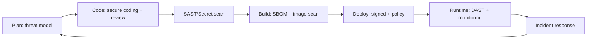

# 08 — Security Design

**Asset Management System (AMS) — Enterprise & SaaS Multi-Tenant**

| | |
|---|---|
| Versi | 1.0 |
| Tanggal | Juli 2026 |
| Acuan | PRD §6 Security, `02-SAD`, `03-ERD`, `04-API` |
| Framework | OWASP ASVS, OWASP Top 10, NIST, ISO 27001 (arahan) |

---

## 1. Prinsip Keamanan
1. **Zero Trust** — verifikasi setiap request (identitas + tenant + otorisasi).
2. **Defense in Depth** — berlapis: edge, jaringan, aplikasi, data.
3. **Least Privilege** — akses minimal (RBAC granular, quota).
4. **Secure by Default** — konfigurasi aman sejak awal, deny-by-default.
5. **Tenant Isolation by Design** — pemisahan data mutlak antar tenant.
6. **Auditability** — semua aksi sensitif tercatat immutable.

---

## 2. Threat Model (Ringkas — STRIDE)
| Ancaman | Contoh | Kontrol |
|---------|--------|---------|
| **S**poofing | pemalsuan identitas/QR | OIDC/MFA, QR signed HMAC |
| **T**ampering | ubah data/nilai aset | RBAC, audit log, integrity check |
| **R**epudiation | sangkal aksi | audit trail immutable + trace |
| **I**nfo disclosure | akses data tenant lain | RLS, IDOR guard, encryption |
| **D**oS | banjir request | rate limit, WAF, autoscale |
| **E**lev. privilege | naik hak akses | least privilege, server-side authz |

**Aset kritikal:** data aset & nilai finansial, dokumen (invoice/berita acara), kredensial, audit log, konfigurasi tenant/IdP.

---

## 3. Identity & Authentication (AuthN)
- **SSO** via Keycloak: OIDC & SAML 2.0, brokering ke **AD / LDAP / Microsoft Entra ID** (PRD §8).
- **Per-tenant IdP**: setiap tenant dapat memakai IdP sendiri (realm/identity provider mapping).
- **MFA**: TOTP/WebAuthn; **wajib** untuk Super Admin & Asset Administrator, opsional lainnya (kebijakan per tenant).
- **Token**: OAuth2 access token (JWT, umur pendek 15 mnt) + refresh token (rotating, revocable). Klaim wajib: `sub`, `tenant_id`, `roles`, `scope`.
- **Session**: penyimpanan aman (httpOnly, Secure, SameSite), revoke saat logout/anomali.
- **Service-to-service**: OAuth2 client-credentials / mTLS.
- **Password policy** (untuk akun lokal fallback): panjang ≥ 12, cek breach, lockout/backoff.

---

## 4. Authorization (AuthZ) — RBAC + Tenant

### 4.1 Model
- **RBAC** granular: permission format `resource:action`.
- Otorisasi **server-side wajib** di setiap endpoint (jangan andalkan UI).
- **Tenant scoping** ditambahkan otomatis (RLS + guard) → mencegah **IDOR** lintas tenant.

### 4.2 Matriks Role → Permission (ringkas)
| Permission | Super Admin | Asset Admin | Procurement | Teknisi | Auditor | Dept Manager | Employee |
|-----------|:-:|:-:|:-:|:-:|:-:|:-:|:-:|
| tenant/system config | ✅ | – | – | – | – | – | – |
| user/role manage | ✅ | ◐ | – | – | – | – | – |
| asset:create | ✅ | ✅ | ✅ | – | – | – | – |
| asset:read | ✅ | ✅ | ✅ | ✅ | ✅ | ✅ | ◐ (miliknya) |
| asset:update/delete | ✅ | ✅ | – | – | – | – | – |
| assignment/transfer | ✅ | ✅ | – | – | – | ◐ (approve) | ◐ (request) |
| borrowing | ✅ | ✅ | – | – | – | ◐ (approve) | ✅ (request) |
| maintenance:work | ✅ | ✅ | – | ✅ | – | – | – |
| ticket:create | ✅ | ✅ | ✅ | ✅ | ✅ | ✅ | ✅ |
| audit:perform | ✅ | ◐ | – | – | ✅ | – | – |
| disposal:request | ✅ | ✅ | – | – | – | ◐ | – |
| disposal:approve | ✅ | – | – | – | – | ✅ | – |
| reports:view | ✅ | ✅ | ◐ | ◐ | ✅ | ✅ | – |
| billing:manage | ✅ | – | – | – | – | – | – |

✅ penuh · ◐ terbatas/kondisional · – tidak ada

---

## 5. Tenant Isolation (SaaS)
| Lapisan | Kontrol |
|---------|---------|
| Request | Tenant di-resolve (subdomain/JWT) & **dicocokkan** dengan klaim token → mismatch ditolak `403` |
| Aplikasi | `TenantContext` wajib; repository menolak query tanpa tenant |
| Database | **RLS** `tenant_id = current_setting('app.current_tenant')`; role DB non-superuser |
| Storage | Prefix `tenants/{tenantId}/`; presigned URL terbatas & short-lived |
| Search | Index/filter `tenant_id` wajib pada setiap query ES |
| Cache | Key namespaced `tenant:{id}:...` |
| Enkripsi | Opsi **per-tenant data key** (envelope encryption) untuk tier Enterprise |
| Quota | Rate limit & resource quota per tenant (anti noisy-neighbor) |

> Uji isolasi otomatis (lihat `07-Testing-Plan §5.1`) menjadi **gate rilis**.

---

## 6. Data Protection & Cryptography
- **In transit**: TLS 1.2+ (prefer 1.3) di semua kanal; HSTS; sertifikat dikelola otomatis (ACME).
- **At rest**: enkripsi volume DB & object storage (AES-256) via **KMS**; kunci dirotasi.
- **Field sensitif**: enkripsi/tokenisasi kolom tertentu bila diperlukan (mis. data pribadi custodian).
- **Envelope encryption**: DEK per-tenant dibungkus KEK di KMS.
- **Secrets**: disimpan di Vault/Secret Manager; **tidak** di kode/env plaintext; rotasi berkala.
- **Hashing**: password (jika lokal) Argon2id; QR signature HMAC-SHA256 (kunci per tenant).
- **PII**: inventarisasi & minimisasi; masking di log & non-prod.

---

## 7. Application Security (OWASP Top 10)
| Risiko | Kontrol |
|--------|---------|
| Broken Access Control | RBAC server-side, RLS, IDOR test, deny-by-default |
| Cryptographic Failures | TLS, KMS, tidak simpan rahasia di klien |
| Injection | ORM parametrik, validasi input (Zod/DTO), no raw SQL tanpa binding |
| Insecure Design | threat modeling, secure design review |
| Security Misconfig | hardening image, CIS benchmark, header keamanan |
| Vulnerable Components | Trivy, dependency audit, patch SLA |
| AuthN Failures | MFA, lockout, rotating refresh token |
| Data Integrity | signed artifacts, verifikasi webhook signature |
| Logging/Monitoring | audit log + SIEM + alerting |
| SSRF | allowlist egress, validasi URL webhook/integrasi |

**Security headers**: `Content-Security-Policy`, `X-Content-Type-Options`, `X-Frame-Options/frame-ancestors`, `Referrer-Policy`, `Strict-Transport-Security`, `Permissions-Policy`.
**Input/Output**: validasi ketat + output encoding (anti-XSS); upload di-scan (MIME allowlist, ukuran, antivirus hook), disajikan dari domain terpisah/sandboxed.
**API hardening**: rate limit per tenant/user, idempotency, pagination cap, CORS allowlist, tanpa data sensitif di error.

---

## 8. Network & Infrastructure Security
- **Edge**: WAF (OWASP CRS), DDoS protection, TLS termination.
- **Segmentation**: subnet privat untuk DB/broker; hanya gateway yang publik.
- **K8s**: NetworkPolicy deny-by-default, Pod Security Standards, non-root, read-only FS, resource limits, image signing (cosign).
- **Egress control**: allowlist ke sistem eksternal (ERP/IdP/SMTP).
- **Secrets** via CSI/Sealed Secrets. **No** kredensial di image.

---

## 9. Audit Logging & Monitoring
- **Audit log** append-only (`audit_log`): who/what/when/tenant/before/after/traceId/ip (PRD Security §Audit Log, `NFR-5`).
- Event keamanan (login gagal, perubahan role, akses ditolak, ekspor data) dialirkan ke **SIEM**.
- Deteksi anomali (impossible travel, brute force) → alert + auto-lock.
- Retensi log sesuai kebijakan/compliance tenant; integritas log (hash chain/WORM opsional).

---

## 10. Privacy & Compliance
- Prinsip GDPR/UU PDP: **data minimization, purpose limitation, right to erasure** (untuk data pribadi custodian/employee).
- **Data residency** per tenant (region) untuk tier Enterprise.
- **DPA** & sub-processor list untuk SaaS.
- Konfigurasi **retensi & penghapusan** per tenant. Export data tenant (portability) & offboarding (secure delete).

---

## 11. Backup, DR & Business Continuity
- **Backup harian** (PRD `NFR-7`) + **PITR** (WAL). Backup terenkripsi & diuji restore berkala.
- **RPO ≤ 15 mnt, RTO ≤ 1 jam** (lihat `02-SAD §9`).
- DR runbook + drill terjadwal; replikasi cross-region (Enterprise).

---

## 12. Secure SDLC

- Pre-commit secret scanning; PR wajib review + security checks (lihat `07 §10`).
- Pen-test sebelum rilis mayor; bug bounty (opsional).

---

## 13. Incident Response
1. **Detect** (alert SIEM/monitoring) → 2. **Triage & Contain** (isolasi, revoke token/kunci) → 3. **Eradicate** → 4. **Recover** (restore) → 5. **Post-mortem** (blameless) + perbaikan.
- Notifikasi pelanggaran sesuai regulasi & SLA kontrak tenant.
- Playbook khusus: kebocoran antar-tenant, kompromi kredensial, kebocoran kunci.

---

## 14. Pemenuhan Requirement Keamanan PRD
| PRD Security | Implementasi |
|--------------|--------------|
| RBAC | §4 RBAC granular + RLS |
| MFA (opsional) | §3 TOTP/WebAuthn per kebijakan tenant |
| Audit Log | §9 append-only + SIEM |
| HTTPS | §6 TLS 1.2+ wajib, HSTS |
| Data Encryption | §6 at-rest (KMS) & in-transit |
| Backup Harian | §11 backup + PITR + DR |
